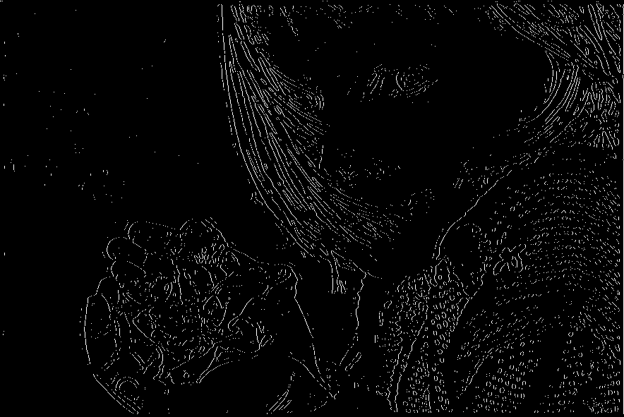

# Edge Detector  

A command-line tool for detecting edges in images using the Laplacian of Gaussian (LoG) filter and thresholding techniques. This project was developed as part of the GNR607 course under the guidance of Prof. B. Krishna Mohan.  

## Requirements  

This script requires Python to run. To install the necessary libraries, execute the following command:  

```bash  
pip install matplotlib numpy pillow scipy  
```  

For Nix users, use `nix develop` to set up the development environment.  

## Usage  

```bash  
python main.py [sigma] [threshold] [file_path] [-s SAVE_PATH]  
```  

### Arguments  

- **sigma (float):** Standard deviation for Gaussian blurring.  
- **threshold (float):** Threshold value for edge detection.  
- **file_path (str):** Path to the input image.  

### Optional Argument  

- **-s SAVE_PATH (str):** Path to save the output image.  

### Example  

```bash  
python main.py 2 0.1 images/lotus.jpg -s results/lotus_edges.png  
```  

This command processes the image `images/lotus.jpg`, applies Gaussian blur with a sigma of 2, and detects edges using a threshold of 0.1. The resulting edge-detected image will be saved as `results/lotus_edges.png`.  

## Results  

Below are examples of edge-detected images produced by the tool.  

| Original Image                  | Edge-Detected Result            |  
|---------------------------------|---------------------------------|  
|    |    |  
|    |    |  
