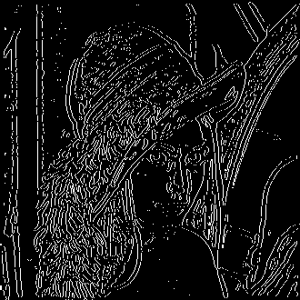
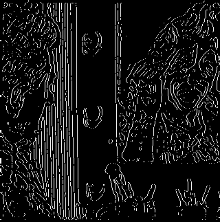

# Edge Detector  

A GUI tool for detecting edges in images using the Laplacian of Gaussian (LoG) filter and thresholding techniques. This project was developed as part of the GNR607 course under the guidance of Prof. B. Krishna Mohan.  

---

## Requirements  

For running the script using python install the necessary libraries:  

```bash  
pip install matplotlib numpy pillow scipy tk 
```  

For Nix users, use `nix develop` to set up the development environment.  

If using the Windows binary, no installation is required.  

---

## Usage  

### GUI  

The Edge Detector includes an intuitive GUI with the following features:  

1. **Input Fields:**  
   - **File Input:** Browse and select the input image.  
   - **Sigma:** Specify the standard deviation for Gaussian blurring.  
   - **Threshold:** Set the threshold value for edge detection.  

2. **Buttons:**  
   - **Show:** Generates an in-memory edge-detected image and displays it.  
   - **Save:** Saves the currently displayed edge-detected image to disk.  
   - **Clear:** Resets all inputs and clears the in-memory image.  
---

## Windows Binary  

For convenience, a pre-compiled binary is included for Windows users. Simply run the binary file to use the GUI version of the tool.  

---

## Results  

Below are examples of edge-detected images produced by the tool.  

| Original Image                  | Edge-Detected Result            |  
|---------------------------------|---------------------------------|  
|    |    |  
|    |    |  
|    |    |  
|    |    |  
